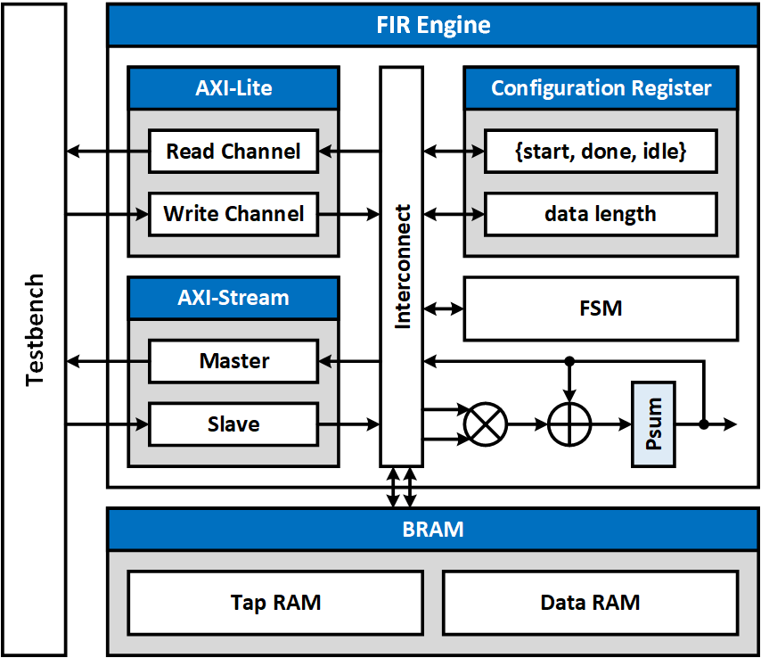
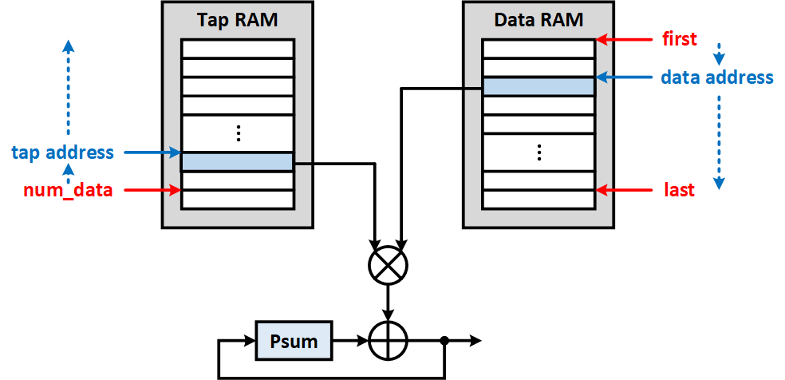

# FIR - Verilog implementation with AXI interface and SRAM

## Interface
- AXI-Stream
    - data_in ( Xn )
    - data_out ( Yn )
- AXI-Lite
    - coef[Tape_Num-1:0]
    - data_length
    - ap_start
    - ap_done
    - ap_idle

## Specification
- Data width = 32
- Number of tap coefficients = 11
- Number of data is determined by the testbench
###
- Only use one multiplier and one adder for convolution
- Shift register should be implemented with SRAM
- Tap coefficients should be stored in SRAM
- Set ap_start to initiate FIR engine (valid for 1 cycle)
- Stream in Xn. The input rate is depending on the FIR processing speed. Use AXI-Stream valid/ready for flow control.
- Stream out Yn. The output rate depends on the FIR processing speed.

## Block diagram

